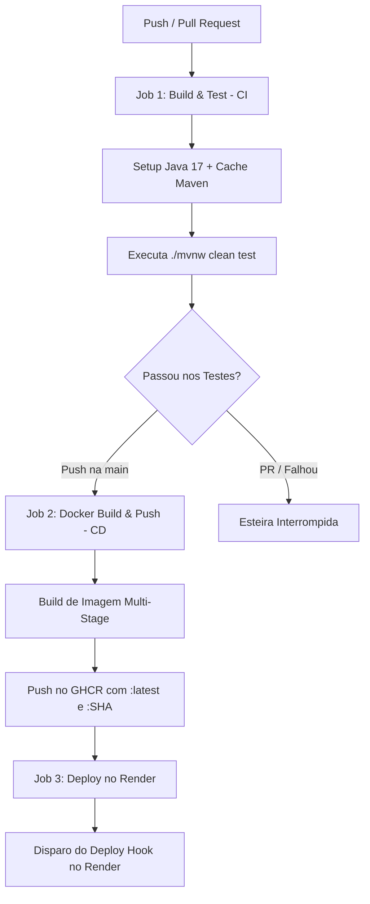

<div align="center">
  <a href="README.pt-br.md">
    
  </a>
  <a href="README.md">
    
  </a>
</div>

# Spring Secure Identity API

## Resumo
API RESTful robusta para gestão de usuários, focada em segurança e boas práticas de desenvolvimento. 
A aplicação permite o ciclo completo de gerenciamento (CRUD) com controle de acesso baseado em papéis (RBAC).

O sistema diferencia usuários comuns (**USER**) de administradores (**ADMIN**), onde apenas administradores possuem 
privilégios para remover usuários do sistema e alterar o privilégio de permissão. 
A autenticação é via JWT (JSON Web Token) com estratégia de **Refresh Token** persistido em banco de dados para maior segurança.

## Tecnologias Utilizadas

* **Linguagem:** Java 17
* **Framework:** Spring Boot 3
* **Segurança:** Spring Security + JWT (Auth0)
* **Banco de Dados:** PostgreSQL 16
* **ORM:** Hibernate / Spring Data JPA
* **Infraestrutura:** Docker & Docker Compose
* **CI/CD & Registry:** GitHub Actions, GitHub Container Registry (GHCR), Render
* **Ferramentas:** Lombok, Maven
* **Documentação:** SpringDoc OpenAPI (Swagger UI)
* **Testes:** JUnit 5, Mockito
* **Logs:** SLF4J & Logback 

## Estudos Aplicados

Este projeto foi desenvolvido com foco na aplicação de conceitos avançados de Engenharia de Software e Segurança:

* **Autenticação Stateless & Stateful:** Implementação híbrida usando Access Token (curta duração) e Refresh Token (longa duração persistido no banco).
* **Segurança por Camadas:** Proteção de rotas via `SecurityFilterChain`, criptografia de senhas com BCrypt e validação de dados com Bean Validation.
* **Tratamento Global de Erros**: Centralização de exceptions com @RestControllerAdvice para padronização de respostas HTTP.
* **Auditoria Automática**: Uso de JPA Auditing para gestão automática de timestamps (createdAt, updatedAt) nas entidades.
* **Gestão de Segredos:** Uso de variáveis de ambiente e placeholders (`${...}`) para não expor credenciais sensíveis no código-fonte.
* **Containerização:** Configuração de ambiente de desenvolvimento portátil usando Docker Compose (Aplicação + Banco).
* **Multi-Stage Docker Builds:** Otimização de compilação em 2 estágios (estágio `builder` JDK + estágio de execução JRE Alpine) reduzindo drasticamente o tamanho final da imagem e o tempo de deploy.
* **Esteira de CI/CD & Deploy Automático:** Pipeline completa no GitHub Actions com testes automatizados (CI), empacotamento e publicação da imagem no GHCR com tags `:latest` e `:${{ github.sha }}` (CD), e disparo de deploy automatizado via Webhook no Render.
* **Arquitetura:** Separação de responsabilidades (Controller, Service, Repository, DTOs e Entities).
* **Testes:** Implementação de testes unitários e de integração com JUnit 5 e Mockito.
* **Logs:** Implementação de logging com SLF4J e Logback.

## Esteira de CI/CD & Deploy Contínuo

O repositório conta com uma pipeline totalmente automatizada via **GitHub Actions** (`.github/workflows/ci-cd.yml`), dividida em 3 estágios:



### Detalhamento dos Jobs:

1. **`build-and-test` (Integração Contínua - CI)**:
   - Disparado em `push` nas branches `main`/`develop` e `pull_request` para a `main`.
   - Configura o JDK 17 (Temurin) com cache de dependências Maven.
   - Compila a aplicação e executa testes unitários/integrados (`./mvnw clean test`).

2. **`docker-build-push` (Entrega Contínua - CD)**:
   - Executado após o sucesso dos testes em pushes diretos na branch `main`.
   - Autentica no **GitHub Container Registry (GHCR)** utilizando o `secrets.GITHUB_TOKEN`.
   - Constrói e envia a imagem Docker com dupla rotulagem: `:latest` e `:${{ github.sha }}` para permitir suporte a rollback seguro.

3. **`deploy-render` (Implantação Contínua - CD)**:
   - Executado automaticamente após o push da imagem na `main`.
   - Envia uma requisição HTTP POST para a URL configurada na secret `secrets.RENDER_DEPLOY_HOOK_URL`, atualizando a aplicação em nuvem no Render.

## Documentação Interativa

O projeto utiliza **Swagger UI** para documentação e teste automático dos endpoints.
Após subir a aplicação, acesse:

👉 **http://localhost:8081/swagger-ui.html**

Lá você poderá:
* Visualizar todos os endpoints disponíveis.
* Testar requisições (Login, Cadastro, Refresh) diretamente pelo navegador.
* Autenticar-se usando o botão **Authorize** (copie o token gerado no endpoint de login).

## Instalação e Execução

### Pré-requisitos
* Docker e Docker Compose instalados.
* (Opcional) Java 17 e Maven para rodar localmente fora do container.

### Passo 1: Configuração de Ambiente (.env)
Por segurança, o projeto não compartilha senhas reais. Crie um arquivo `.env` na raiz do projeto 
(onde está o `docker-compose.yml`) com o seguinte conteúdo:

```properties
# Configuração do Banco de Dados
POSTGRES_DB=ssi_db
POSTGRES_USER=postgres
POSTGRES_PASSWORD=sua_senha_forte_aqui

JWT_SECRET=segredo_super_secreto_para_gerar_token

# Configuração do Admin Inicial (Seed)
ADMIN_EMAIL=admin@email.com
ADMIN_PASSWORD=admin
ADMIN_CREATE=true

# Configuração do Frontend (CORS)
APP_FRONTEND_URL_LOCAL=http://localhost:4200
```
> **Nota:** Ao iniciar a aplicação pela primeira vez com `ADMIN_CREATE=true`, um usuário administrador será criado 
> automaticamente com as credenciais definidas no `.env`, permitindo o acesso imediato às rotas protegidas.

### Passo 2: Rodando com Docker (Recomendado)

Na raiz do projeto, execute:

```docker
docker compose up --build
```
A API estará disponível em: http://localhost:8081

### Passo 3: Rodando Localmente (Sem Docker)

Caso queira rodar a aplicação via IDE (IntelliJ/Eclipse) e apenas o banco no Docker:

Suba apenas o banco: 

```docker
docker compose up db -d
```

A aplicação usará automaticamente as configurações padrão de desenvolvimento (localhost, user: postgres, pass: 12345) 
definidas no application.properties via fallback.

